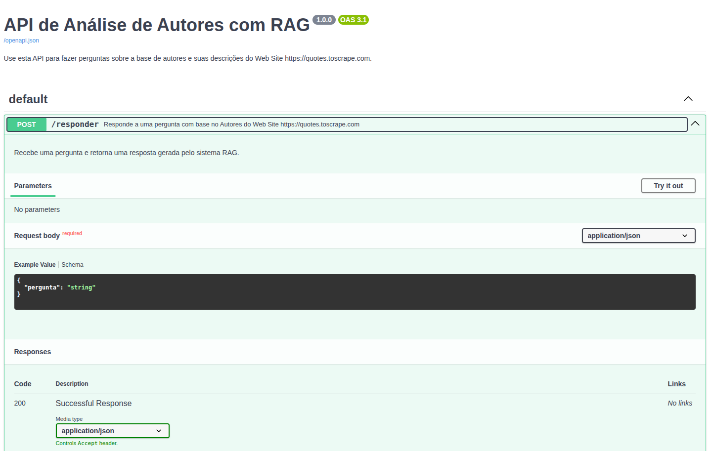
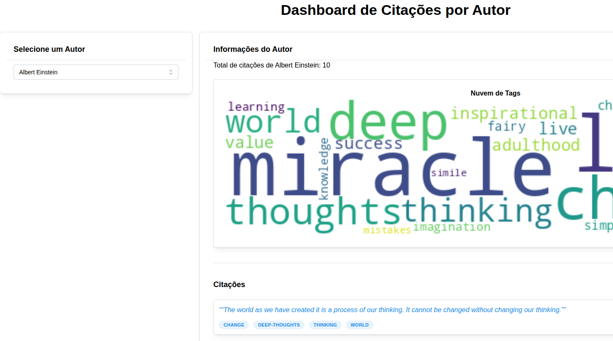

**DataHarvesting** 
---

É um projeto desenvolvido em **Python** que integra coleta de dados, inteligência artificial e visualização interativa em uma solução completa de análise e geração de conhecimento.

O sistema é composto por quatro módulos principais:

* **Coletor (Web Scraping/RPA):** automatiza a extração de informações de autores, citações e tags do site *quotes.toscrape.com*, salvando os dados em formato CSV.
* **Agente (IA com RAG):** utiliza o **LangChain** e a **API do Google Gemini** para criar uma base vetorial e responder perguntas contextuais sobre os autores, combinando técnicas de embeddings e busca semântica.
* **API (FastAPI):** expõe endpoints REST para interação com o agente e integração com outros sistemas.
* **Dashboard (Dash):** oferece uma interface interativa para explorar os dados e insights extraídos, com filtros, visualizações e estatísticas.

O projeto segue boas práticas de desenvolvimento, como modularização, uso de ambiente virtual, documentação detalhada e licença **GPL**. Ele demonstra competências em **engenharia de dados, IA aplicada, arquitetura de software e visualização interativa**, unindo múltiplas tecnologias em um pipeline coeso.


Tabela de conteúdos
---
<!--ts-->   
   * [Tecnologias](#🛠-tecnologias-utilizadas)
   * [Criação Virtualenv](#criação-virtualenv)
   * [Instalação Pacotes](#instalação-de-pacotes)
   * [Acessando Virtualenv](#acessando-virtualenv---wsl-linux)
   * [Componentes](#componentes)
     * [Api Analise de Autores](#api-analise-de-autores)     
     * [Dashboard](#dash)
   * [Referências](#referências)
   * [Contribuição](#contribuidor)
   * [Autor](#autor)
   * [Licença](#licença)
<!--te-->


Tecnologias Utilizadas
---
As seguintes ferramentas foram usadas na construção do projeto:

- [Python 3.13](https://docs.python.org/pt-br/3/)


### Criação Virtualenv


```bash
python3 -m venv .venv
```


### Acessando Virtualenv - WSL, Linux


```bash
source .venv/bin/activate
```

### Acessando Virtualenv - Windows


```bash
.venv/Scripts/activate.bat
```


### Instalação de Pacotes


```bash
python -m pip install -r requirements.txt
```


Componentes
===

### Api Analise de autores

Contem três modulos responsaveis por coletar os dados utilizando RPA buscando esses dados na internet, diponibilizando um endpoint para que seja feita uma pergunta sobre os autores, citações atravez de uma base vetorial que utiliza um LLM com suas orientações, disponibilizar uma resposta a um pergunta.

1. Coletor

  * Este componente é responsavel por gerar arquivos **.csv** onde coletam dados de Autor, Citações, Tgas, links das páginas, e descrição do autor em páginas about(sobre), percorendo todas as páginas do site **http://quotes.toscrape.com** para fins de estudo, pode consultar a documentação deste componente neste [link](https://github.com/WagnerCOliveira/DataHarvesting/blob/main/src/docs/COLETOR.md)

2.  Agent

  * Este código implementa um sistema de Geração Aumentada por Recuperação (RAG - Retrieval-Augmented Generation) utilizando o framework LangChain e a API do Google Gemini.

  * O objetivo principal do agent é responder perguntas sobre autores com base em um conjunto de dados fornecido em um arquivo CSV. Ele faz isso processando o CSV, criando uma base de conhecimento vetorial e, em seguida, usando um modelo de linguagem grande (LLM) para formular respostas precisas com base nos trechos de dados recuperados (chunks). Pode consultar a documentação neste [link](https://github.com/WagnerCOliveira/DataHarvesting/blob/main/src/docs/AGENT.md)

3. Fastapi APP

  * Um código Python que implementa uma API para um sistema de Geração Aumentada por Recuperação (RAG - Retrieval-Augmented Generation), focado na análise de autores. Pode consultar a documentação neste [link](https://github.com/WagnerCOliveira/DataHarvesting/blob/main/src/docs/APP_FASTAPI.md)

4. Inicando Api local.

```bash

$ cd src/
$ python app.py

```




### Dash


Com esses três arquivos, você tem uma visão completa de como o dashboard funciona, que proporciona uma visualização das citações extraidas pelo componente coletor.

1. Layout: Define a interface.

  * Cria toda a estrutura HTML e de componentes visuais que será exibida ao usuário. Ele organiza o conteúdo em um Container principal, usando um sistema de Grid para dividir a tela em duas colunas principais:

    * Coluna da Esquerda (Pequena): Para seleção de um autor.
    * Coluna da Direita (Grande): Para exibir informações e gráficos relacionados ao autor selecionado.
    
    Documentação neste [link](https://github.com/WagnerCOliveira/DataHarvesting/blob/main/src/docs/DASH_LAYOUT.md)

2. Callbacks: Processa dados e atualiza a interface.

  * O objetivo principal é: quando um autor é selecionado no dropdown (seletor), o código filtra os dados, calcula as estatísticas e gera os componentes visuais de saída (total de citações, nuvem de tags e lista detalhada de citações).Trechos-chave do Processamento:

Documentação neste [link](https://github.com/WagnerCOliveira/DataHarvesting/blob/main/src/docs/DASH_CALLBAKS.md)

3. App (Este arquivo): Inicializa e executa tudo.

  * Inicializar a aplicação Dash.
  * Importar o layout visual (layout_children) e a lógica de interatividade (funções de callback).
  * Definir o layout final do aplicativo, envolvendo-o com o tema visual Mantine.
  * Executar o servidor web para que o dashboard possa ser acessado pelo navegador.

  Documentação neste [link](https://github.com/WagnerCOliveira/DataHarvesting/blob/main/src/docs/DASH_APP.md)


4. Iniciando Dashboard local

```bash

$ cd src/dash
$ python app.py

```




Referências
===

- [Python Documentação](https://docs.python.org/pt-br/3/)
- [Pandas Documentação](https://pandas.pydata.org/docs/)
- [Dash Documentação](https://dash.plotly.com/)


Contribuidor
===

- Wagner da Costa Oliveira

Autor
===

- Wagner da Costa Oliveira

Licença
===

- [GNU General Public License (GPL)](https://www.gnu.org/licenses/gpl-3.0.html)